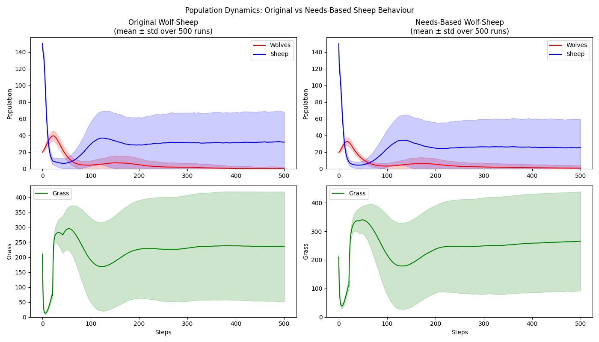

# Needs-Based Wolf-Sheep Predation Model

## What the model does and why I chose it

This model extends Wolf-Sheep with persistent hunger and fear drives that accumulate and decay over time, rather than being recalculated fresh each step. This means a sheep that just escaped a wolf remains scared even when no wolves are currently visible, and a sheep that hasn't eaten for several steps becomes increasingly desperate. Sheep must weigh these competing drives each step and choose between fleeing to safety or seeking food. I chose this model because EwoutH explicitly cited it as a pain point and because the gap between theory (utility-based agents weighing competing drives) and Mesa's current implementation was immediately visible in the code.

## What Mesa features it uses

- **CellAgent / FixedAgent** ('mesa.discrete_space') - base classes for animals and grass patches respectively
- **OrthogonalVonNeumannGrid** - 20x20 grid with 4 directional neighbourhoods, torus wrapped so that agents don't get stuck at edges. 
- **cell.neighborhood and select()** - used to scan adjacent cells for wolves, grass, and safe movement targets 
- **schedule_event** - grass regrowth is scheduled as a future event rather than checked probabilistically each step 
- **DataCollector** - tracks wolf, sheep, and grass populations each step for comparison analysis
- **agents_by_type and shuffle_do** - sheep and wolves are stepped separately in random order to avoid activation bias
- **create_agents** - batch creation of sheep and wolves with randomised starting energy
- **self.rng** - seeded random number generation for reproducible runs across 500 comparisons

## What I learned building it

Building this model gave me my first real hands-on experience with Mesa's architecture. I noticed a strong parallel with PDDL planning from my Reasoning and Agents coursework; model.py functions like a problem file defining the world state and initial conditions, while agents.py resembles a domain file defining agent types and their action schemas. The key difference is that PDDL has a planner that selects actions to achieve goals, whereas Mesa agents execute a fixed step sequence. The Behavioural Framework project aims to make these kinds of behavioural architectures expressible in Mesa, not by adding automatic planning but by providing the right abstractions for modellers to implement them cleanly. 

I learned how Mesa's DataCollector and population graphs work as indirect tools for understanding agent behaviour. I also learnt you are able to observe agents' drive states in Mesa, but it is a bit disconnected in the workflow. You collect agent attributes via DataCollector, export them to a dataframe post-run, and plot separately. There's no integrated way to watch internal agent state evolve in real time during simulation in SolaraViz. For behavioural modeling specifically, this matters: I spent time tuning the drive accumulation and decay rates by watching the population-level outcomes across hundreds of runs, when direct observation of individual drive states would have been faster and more informative in this case.

I also learned that small parameter changes, such as wolf predation pressure, can dramatically change whether the behavioural difference between models is visible at all. The needs-based architecture only produces meaningfully different outcomes when I ramped up the predation pressure. I have learned the importance of activation order, since a modeling decision such as stepping sheep before wolves each turn ensures that sheep have a chance to act before being eaten, a decision that significantly affects the outcomes.

## What was hard, what surprised me, What I'd do differently

**Technical friction:**
- The original Wolf-Sheep example uses Mesa's experimental Scenario class to define model parameters. As someone new to Mesa, encountering this pattern without prior context made the model harder to read, and I didn't immediately recognise it was abstracting the '__init__' parameters, or that it was an experimental feature rather than a core Mesa pattern. Replacing it with direct '__init__' parameters made the model more straightforward to understand and modify. 
- Ensuring the comparison between original and needs-based models was fair required careful thought about matching parameters across both models.
- Small technical issue as Mesa requires networkx but this wasn't installed for my Python version, which produced an unexpected import error (fast to resolve but still notable).

**Conceptual friction:**
- When deciding on specific parameters such as 'max_energy', I had to arbitrarily pick a value that seemed reasonable with no real principled basis. 
- The same issue applied to drive rates (e.g. 0.05 hunger accumulation, 0.1 fear decay, 0.3 wolf spike); these values had no real bases except estimation and small tweaks guided by the population graphs. 

**What I'd do differently:**
- I would take better notes when building, as I had to reconstruct many of my friction points from memory for this README.
- Add agent_reporters from the start to observe drive states directly rather than just inferring changes from the population graph.
- Use drive state visualisation and population graphs hand in hand to guide the parameter choices clearly from the beginning.
- I would spend more time working out how the changes in parameters affect the results, to create stronger comparisons between models.
- I would construct better visualisations and analysis from the collected data if I had more time to work on these models. 

## Results

*Mean ± standard deviation over 500 runs. Both models use identical parameters: 150 sheep, 20 wolves, sheep_reproduce = 0.08, wolf_gain_from_food=12.0, grass_regrowth_time=20.0*

Under identical parameters (wolf_gain_from_food=12.0, 500 runs), both models produce similar mean population dynamics — sheep recover to a stable low population, wolves decline toward zero, and grass settles at moderate levels. The primary visible difference is that the original model shows higher variance in sheep and grass populations, suggesting needs-based sheep produce slightly more consistent outcomes. The mean trajectories are not substantially different.
This is itself a meaningful finding, showing a simple utility function with two competing drives is not sufficient to produce dramatically different ecosystem outcomes under moderate predation pressure. The architectural change matters, but its effect is subtle. However, it could be worth testing other conditions to see how this change behaviour can affect the difference in outcomes. This points directly at what the Behavioral Framework project needs to deliver: richer primitives for goal structures, memory, and learning that produce qualitatively different agent behaviour, not just marginal differences in population variance.

The core architectural gap that this model exposes is that Mesa provides no native abstraction for action selection based off of drive states. Implementing 'decide_and_act()' required removing Mesa's existing step structure and building a new decision method from scratch. A behavioural framework that provides this as a standard primitive would make needs-based and utility-based models significantly easier to implement and compare. 